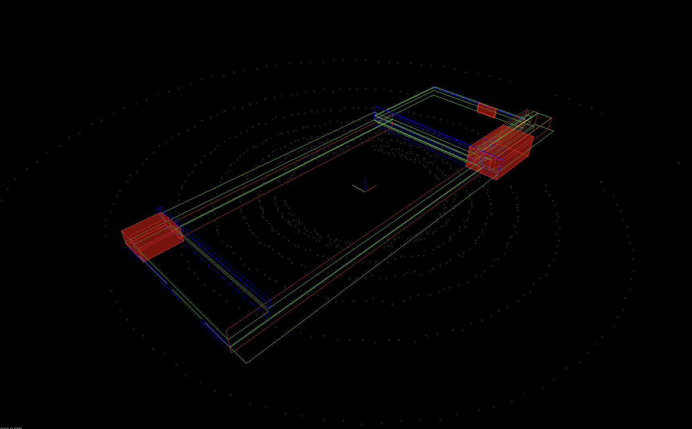

# Udacity Sensor Fusion Engineer Nanodegree

My Udacity Sensor Fusion Engineer Nanodegree projects, in C++.

# Core Projects

## Environment

* Ubuntu 20.04-5 LTS Focal Fossa running on UTM Virtual Machine on MacBook Pro M1 Max (aarch64)
* Point Cloud Library 1.11 - [Built from Source](https://pcl.readthedocs.io/projects/tutorials/en/latest/compiling_pcl_posix.html#stable)

## Project 1: LiDAR Obstacle Detection

* [Starter Code](https://github.com/udacity/SFND_Lidar_Obstacle_Detection)

