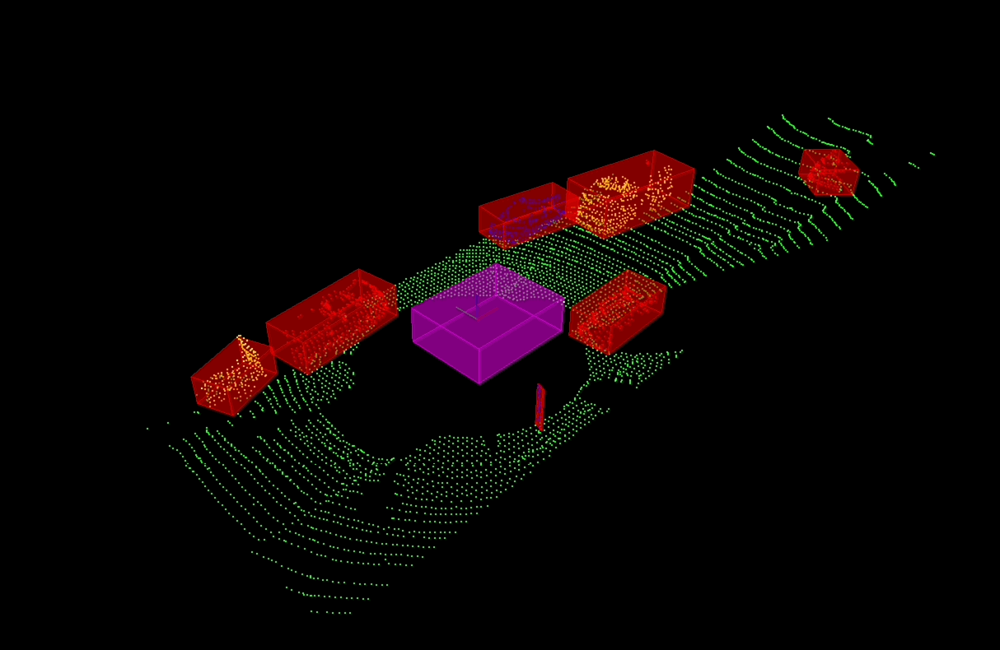

# Udacity Sensor Fusion Engineer Nanodegree

My Udacity Sensor Fusion Engineer Nanodegree projects, in C++.

# Core Projects

## Environment

* Ubuntu 20.04-5 LTS Focal Fossa running on UTM Virtual Machine on MacBook Pro M1 Max (aarch64)
* Point Cloud Library 1.11 - [Built from Source](https://pcl.readthedocs.io/projects/tutorials/en/latest/compiling_pcl_posix.html#stable)

## Project 1: LiDAR Obstacle Detection

__Acquired familiarity with:__ Point Cloud Library (PCL).

### Overview

_Process raw LiDAR data with filtering, segmentation, and clustering to detect vehicles on the road: reduce the size of a point cloud using voxel grid and region-of-interest techniques, implement custom RANSAC planar model fitting and Euclidean clustering with KD-Trees to segregate and distinguish vehicles and obstacles, then bind the latter into boxes._

* [Starter Code](https://github.com/udacity/SFND_Lidar_Obstacle_Detection)

__[Link to code](projects/p1/)__

### How to Build and Run the Project

Clone the repository locally, for example inside `/home/$whoami/workspace` (with `$whoami` the username of the current user). Then build and run the main project as follows. To build and run `quiz` instead, see the project's README file.

```bash
cd /home/$whoami/workspace/udacity-rsend/projects/p1
mkdir build && cd build
cmake ..
make
./environment
```

### Output



