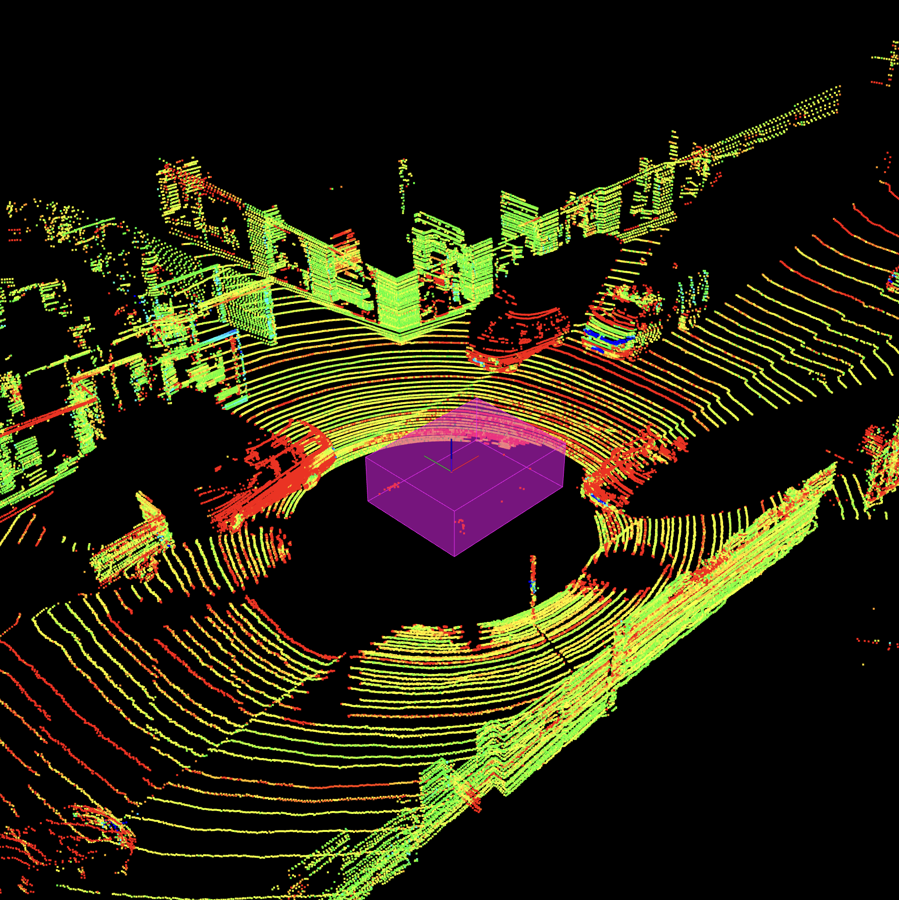

# Udacity Sensor Fusion Engineer Nanodegree

My Udacity Sensor Fusion Engineer Nanodegree projects, in C++.

## [Certificate of Completion](https://www.udacity.com/certificate/e/a75714f6-1c0d-11ee-8912-6751ad62567e)


# Core Projects

## Environment

* Ubuntu 20.04-5 LTS Focal Fossa running on UTM Virtual Machine on MacBook Pro M1 Max (aarch64)
* Point Cloud Library 1.11 ([Built from Source](https://pcl.readthedocs.io/projects/tutorials/en/latest/compiling_pcl_posix.html#stable))
* OpenCV 4.2.0 ([Built from Source](https://github.com/federicomariamassari/udacity-rsend/blob/main/projects/p4/p4-preliminary-config.md#3-rebuild-opencv-from-source-with-patented-modules))
* MATLAB R2023b Home License (on Apple Silicon), Signal Processing Toolbox

## [Project 1: LiDAR Obstacle Detection](projects/p1/p1-lidar-obstacle-detection.md)

__Acquired familiarity with:__ Point Cloud Library (PCL), the Eigen library.

### Overview

_Filter, segment, and cluster raw LiDAR data to detect vehicles and obstacles on the road._

In this assignment I learn how to process point clouds from LiDAR scans in order to identify vehicles and other obstacles in a driving environment. I first reduce cloud size using voxel (volumetric pixel) grid and region of interest techniques, then separate road and obstacles via RANSAC (RANdom SAmple Consensus), group points belonging to the same objects using Euclidean clustering with 3-dimensional KD-Trees, and finally enclose the obtained clusters within either regular or minimum (PCA-based) bounding boxes.

__[Link to code](projects/p1/src)__ | [Starter Code from Udacity](https://github.com/udacity/SFND_Lidar_Obstacle_Detection)

<table>
  <tr>
    <td align="center"></td>
    <td align="center"></td>
  </tr>
</table>

### How to Build and Run the Project

Clone the repository locally, for example inside `/home/$whoami/workspace` (with `$whoami` the username of the current user). Ensure PCL and associated Viewer are [installed correctly](projects/p1/p1-preliminary-configs.md), then build and run the main project as per below commands. To build and run `quiz` instead, see the project's README file.

```bash
cd /home/$whoami/workspace/udacity-rsend/projects/p1
mkdir build && cd build
cmake ..
make
./environment
```

### Output

A stream of incoming obstacles, encapsulated in PCA bounding boxes, is rendered in the city block scene below. Udacity's self-driving vehicle Carla is the purple block at the center of the screen, with LiDAR mounted on top.


## [Project 2: Camera-Based 2D Feature Tracking](projects/p2/p2-camera-based-2d-feature-tracking.md)

__Acquired familiarity with:__ OpenCV 4.x, Gnumeric.

### Overview

_Learn to detect, describe, and match features in 2D camera images._

In this computer vision application, I implement a two-dimensional feature tracking algorithm to monitor objects in a sequence of images using OpenCV. After progressively loading the pictures in a data ring buffer, I use classic and modern techniques to detect keypoints, calculate their descriptors, match the features between consecutive frames, and finally evaluate the performance of each detector-descriptor combination in terms of speed and accuracy.

__[Link to code](projects/p2/src)__ | [Starter Code from Udacity](https://github.com/udacity/SFND_2D_Feature_Tracking)


### How to Build and Run the Project

As a prerequisite, build OpenCV 4.2.0 [from source](https://github.com/federicomariamassari/udacity-rsend/blob/main/projects/p4/p4-preliminary-config.md#3-rebuild-opencv-from-source-with-patented-modules) to enable patented algorithms SIFT and SURF. Then build and run as follows:

```bash
cd /home/$whoami/workspace/udacity-rsend/projects/p2
mkdir build && cd build
cmake ..
make
./2D_feature_tracking
```

### Output

Set both `bCompareDetectors` and `bCompareDescriptors` to `false` to visualize matched keypoints among image pairs for the chosen detector and descriptor. Set either (or both) to `true` to output tabulated statistics on the distribution of keypoints' neighborhood size (MP.7) and/or comparisons among detector-descriptor combinations (MP.8-9).


## [Project 3: Track an Object in 3D Space](projects/p3/p3-track-an-object-in-3d-space.md)

### Overview

_Fuse LiDAR and camera data to compute a robust time-to-collision estimate._

In part 2 of the camera course, I integrate data from LiDAR and camera sensors to provide an estimate of time-to-collision (TTC) with a vehicle in front, in the context of a Collision Detection System (CDS). After classifying the objects on the road using deep learning framework YOLOv3, I identify the LiDAR points and keypoint matches that fall within the region of interest (ROI) of the bounding box enclosing the preceding car, and use these to compute reliable estimates of TTC for both sensors.

__[Link to code](projects/p3/src)__ | [Starter Code from Udacity](https://github.com/udacity/SFND_3D_Object_Tracking)


### How to Build and Run the Project

For the prerequisites, see project 2. Download the YOLOv3 weights inside the `dat/yolo` folder:

```bash
wget https://pjreddie.com/media/files/yolov3.weights
```

Then build and run as follows:

```bash
cd /home/$whoami/workspace/udacity-rsend/projects/p3
mkdir build && cd build
cmake ..
make
./3D_object_tracking
```

## [Project 4: Radar Target Generation and Detection](projects/p4/p4-radar-target-generation-and-detection.md)

### Overview

_Analyze radar signatures to detect and track objects._

In this MATLAB project, I generate and propagate a radar signal, simulate its reflection off a target, process the received echo to estimate the target's range and velocity (Doppler) via Fast Fourier Transform (FFT), and finally suppress unwanted noise in the output using 2D Cell-Averaging Constant False Alarm Rate (CA-CFAR).

__[Link to code](projects/p4/src/radar_target_generation_and_detection.m)__

<table>
  <tr>
    <td align="center"></td>
    <td align="center"></td>
  </tr>
</table>

### How to Run the Project

If run locally, this project requires a valid MATLAB license plus Signal Processing Toolbox.

## [Project 5: Unscented Kálmán Filter Highway Project](projects/p5/p5-unscented-kalman-filter-highway-project.md)

### Overview

_Track non-linear vehicle motion blending data from multiple sensors via Unscented Kálmán Filter._

In this capstone assignment, I implement an Unscented Kálmán Filter to estimate the state of multiple cars on a simulated highway, fusing noisy measurements from LiDAR and radar. To cover a wider range of possible state values and capture the uncertainty and variability of the state estimation more accurately, the UKF's sigma points (representative points from a Gaussian distributions) are generated using the Constant Turn Rate and Velocity Magnitude (CTRV) model. This choice impacts the prediction step of the algorithm, and is reflected in the green orbs displayed at the top of each target vehicle. LiDAR and radar markers are also included as red spheres and as magenta arrow lines, respectively.

__[Link to code](projects/p5/src)__ | [Starter Code from Udacity](https://github.com/udacity/SFND_Unscented_Kalman_Filter)


### How to Build and Run the Project

```bash
cd /home/$whoami/workspace/udacity-rsend/projects/p5
mkdir build && cd build
cmake ..
make
./ukf_highway
```

### Output

An alternative outcome, in which the stylised car shapes are replaced by box-bound point cloud clusters, is presented below. Because LiDAR is at times unable to capture the full shape of the vehicles, especially when a target is in front of ego car and moving away from it, the RMSE threshold for X is frequently crossed (the XY-midpoints of the bounding boxes, used to calculate the position of the red orbs, tend to align poorly with the ground truth). Using minimum (PCA-based) boxes does not seem to improve upon the results. Point cloud processing considerably slows down the simulation, but further reducing cloud size through voxel grid sampling would significantly worsen the accuracy of the LiDAR estimate so it is not recommended.


