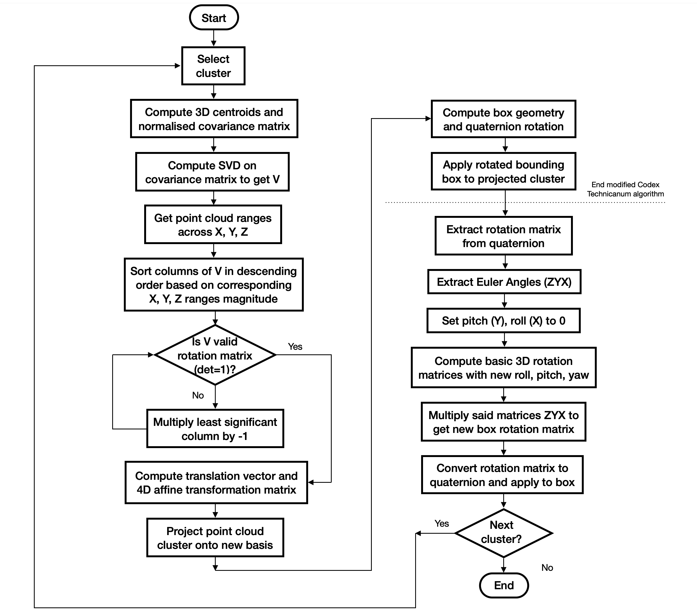

[Home](../../README.md) | Next: 

# Project 1: LiDAR Obstacle Detection

## Overview

In autonomous systems, such as robots or self-driving cars, LiDAR (Light Detection And Ranging) is commonly used as a way to accurately measure distances and create detailed 3-dimensional maps of a surrounding environment. LiDAR targets surfaces with laser beams (photon pulses of a few nanoseconds) and measures the time it takes for the beams to bounce back; when surfaces are hit, Point Cloud Data (PCD) are generated.

In this project, my very first using Point Cloud Library (PCL), I filter, segment, and cluster point clouds from LiDAR scans to detect incoming vehicles and obstacles within a driving environment. For each frame, I start by reducing the density of the cloud using Voxel Grid and Region of Interest (ROI) techniques. This helps to simplify the data and focus on the most relevant information. Next, I use RANSAC to separate the road plane from the obstacles, allowing for a clearer understanding of the environment. To identify individual objects, I employ Euclidean clustering and KD-Trees. This allows me to group together points that belong to the same target, making it easier to analyze and track them. Finally, I encapsulate these clusters within bounding boxes (both regular and PCA-based), providing a visual representation of the detected items [Figure 1].

The project analyses driving scenes of increasing complexity:

1. __Simple Highway__: A sample environment used to test and fine-tune RANSAC, Euclidean Clustering, and Bounding Boxes.
2. __City Block (static)__: A static frame of real point cloud data from Udacity's self-driving car, Carla.
3. __City Block (streaming, linear)__: A stream of frames, of which case 2 is the initial one, depicting a linear road.
4. __City Block (streaming, non-linear)__: Tracking a cyclist through a dynamic, highly non-linear environment (not entirely explored).

__Figure 1: PCA-Boxes-Enclosed Cluster Obstacles__


## Project Structure

The directory structure tree for the project appears in Figure 2. In particular:

- `quiz` contains 2D/3D test implementations for RANSAC (executables: `quizRansac`, `quizRansac3d`) as well as KD-Trees and Euclidean clustering (`quizCluster`, `quizCluster3d`); these serve as prototypes for the main project;

- `src` includes main files `environment.cpp` (executable: `environment`) and `processPointCloud.cpp`, the latter holding all functions that manipulate point cloud data: voxel grid and region of interest filtering, RANSAC, KD-Tree and clustering 3D (logic for these is called from header files), regular and minimum (PCA-based) bounding boxes;

- `custom` has algorithmic implementations for KD-Tree creation and Euclidean clustering, as well as rendering options for all scenarios (in `options.h`, see next section);

- `render` contains helper functions for object rendering, while `sensors` holds, among the others, raw PCD files for different scenarios.

__Figure 2: Directory Structure Tree__

```bash
.
├── build
│   ├── ...
│   └── environment
├── CMakeLists.txt
└── src
    ├── custom
    │   ├── clustering.h
    │   ├── kdtree3d.h
    │   └── options.h
    ├── environment.cpp
    ├── processPointClouds.cpp
    ├── processPointClouds.h
    ├── quiz
    │   ├── cluster
    │   │   ├── build
    │   │   │   ├── ...    
    │   │   │   ├── quizCluster
    │   │   │   └── quizCluster3d
    │   │   ├── CMakeLists.txt
    │   │   ├── cluster.cpp
    │   │   ├── cluster3d.cpp
    │   │   └── headers
    │   │       ├── clustering.h
    │   │       ├── kdtree.h
    │   │       └── kdtree3d.h
    │   └── ransac
    │       ├── build
    │       │   ├── ...  
    │       │   ├── quizRansac
    │       │   └── quizRansac3d
    │       ├── CMakeLists.txt
    │       ├── ransac2d.cpp
    │       └── ransac3d.cpp
    ├── render
    │   ├── box.h
    │   ├── render.cpp
    │   └── render.h
    └── sensors
        ├── data
        │   └── pcd
        │       ├── data_1
        │       │   ├── ...
        │       │   └── 0000000021.pcd
        │       ├── data_2
        │       │   ├── ...
        │       │   └── 0000000153.pcd
        │       └── simpleHighway.pcd
        └── lidar.h
```

## Building and Running the Project

### Rendering Issues

PCL option `pcl::visualization::PCL_VISUALIZER_POINT_SIZE` does not render properly on Ubuntu 20.04-5 (UTM QEMU 7.0 aarch64), so specifying point size (integer) greater than 1 has no effect. This seems to be related to an incomplete VTK 7.1 installation on Ubuntu 20.04 [1] [2]. The consequence is that point clouds are practically invisible when rendered with PCL Viewer on the virtual machine, hence most of the pictures in this README file were captured from the provided Udacity workspace (Ubuntu 16.04, PCL 1.7).

### Main File

```bash
cd /home/$whoami/workspace/udacity-rsend/projects/p1
mkdir build && cd build
cmake ..
make
./environment
```

### Quiz Files

```bash
cd /home/$whoami/workspace/udacity-rsend/projects/p1/src/quiz/{ransac|cluster}
mkdir build && cd build
cmake ..
make
./quiz{Ransac|Cluster}{|3d}
```

### Options

#### Main Options

These are contained in `environment.cpp` (`main` function) and render all available scenarios. If the first option is <code>false</code>, the other two are ignored.

<table>
    <thead>
        <tr>
            <th>Parameter</th>
            <th>Rationale</th>
        </tr>
    </thead>
    <tbody>
        <tr>
            <td><code>renderCityBlock</code></td>
            <td><code>true</code> to display "City Block", <code>false</code> to render "Simple Highway"</td>
        </tr>
        <tr>
            <td><code>streamCityBlock</code></td>
            <td><code>true</code> to continuously stream point cloud data in <code>data_1</code>, <code>false</code> to render the first frame only</td>
        </tr>
        <tr>
            <td><code>trackCyclist</code></td>
            <td><code>true</code> for highly non-linear tracking of a bicyclist and the surrounding objects (PCD: <code>data_2</code>)</td>
        </tr>
    </tbody>
</table>

#### Rendering Options

These are available in `custom/options.h` and render features for a particular scenario:

<table>
    <thead>
        <tr>
            <th>Parameter</th>
            <th>Rationale</th>
        </tr>
    </thead>
    <tbody>
        <tr>
            <td><code>renderScene</code></td>
            <td><code>true</code> to display highway and cars</td>
        </tr>
        <tr>
            <td><code>renderLidarScans</code></td>
            <td><code>true</code> to render LiDAR scans</td>
        </tr>
        <tr>
            <td><code>filterPointCloud</code></td>
            <td><code>true</code> to downsample the point cloud using voxel grid and region of interest filtering</td>
        </tr>
        <tr>
            <td><code>renderDataPoints</code></td>
            <td><code>true</code> to render colorless point cloud data points</td>
        </tr>
        <tr>
            <td><code>renderPlaneCloud</code></td>
            <td><code>true</code> to render inliers in green</td>
        </tr>
        <tr>
            <td><code>renderObstacleCloud</code></td>
            <td><code>true</code> to render obstacles (non-inliers) in red</td>
        </tr>
        <tr>
            <td><code>renderKdTree</code></td>
            <td><code>true</code> to render 3D KD-Tree in the Viewer (only recommended for "Simple Highway")</td>
        </tr>
        <tr>
            <td><code>renderClusters</code></td>
            <td><code>true</code> to render Euclidean Clustering on obstacle data</td>
        </tr>
        <tr>
            <td><code>renderEgoCarBox</code></td>
            <td><code>true</code> to render a box of the approximate Ego Car location in magenta</td>
        </tr>
        <tr>
            <td><code>renderBoxes</code></td>
            <td><code>true</code> to render regular bounding boxes around obstacle data</td>
        </tr>
        <tr>
            <td><code>renderMinimumXyAlignedBoxes</code></td>
            <td><code>true</code> to render XY-plane-aligned minimum bounding boxes</td>
        </tr>
    </tbody>
</table>

## Code Logic

### Voxel Grid

The original point cloud is filtered using voxel grid technique. A voxel (volumetric pixel) is a 3-dimensional [...]. The raw point cloud is subdivided into 3D cubes 20 centimeters in side, and all the points belonging to a particular cube are "approximated" by their _centroid_, a single point in 3D space which has as coordinates the means of all 3 coordinates of the enclosed points. Dimensionality reduction is thus achieved by ?? this cloud of points by the single centroid. 20 cm was found to be a good trade-off between dimensionality reduction and precision/details kept. Cloud achieved a ration of ~100k to ~5k points per frame. Dimension reduction is particularly important for self-driving cars or applications where fast processing of data is essential.

### Region Of Interest (ROI)

Region-based fitting consists, instead, in keeping only a certain section (rectangular prism) of the diving environment, discarding the edges of low significance for object detection and perception of the surroundings, and which introduce additional computational burden (they add little benefit in processing the area, add little information). Since LiDAR is mounted on top of the car (to be able to continuously rotate 360° and perceive the environment), in order to keep the road plane, Z <belongs> [-2m, 1m]. X, Y, instead, are approximately symmetric and in [ ; ] and [ ; ]. This way we detect the road, but no wall or parked cars.

<table>
  <tr>
  <td align="center"><b>Figure 3.A</b>: Raw (unfiltered) point cloud</td>
  <td align="center"><b>Figure 3.B</b>: Voxel grid (20 cm) and ROI -filtered point cloud</td>
  <tr>
  </tr>
  <tr>
    <td align="center"></td>
    <td align="center"></td>
  </tr>
</table>

### RANSAC

```math
\begin{align*}
&Ax + By + Cz + D = 0 \\
\\
&A = (y_2 - y_1)(z_3 - z_1) - (z_2 - z_1)(y_3 - y_1) \\
\\
&B = (z_2 - z_1)(x_3 - x_1) - (x_2 - x_1)(z_3 - z_1) \\
\\
&C = (x_2 - x_1)(y_3 - y_1) - (y_2 - y_1)(x_3 - x_1) \\
\\
&D = -(Ax_1 + By_1 + Cz_1) \\
\\
&distance = \frac{|Ax + By + Cz + D|}{\sqrt{A^2 + B^2 + C^2}}
\end{align*}
```

__Figure 3: RANSAC__


### Euclidean Clustering

<table>
  <tr>
  <td align="center"><b>Figure 4.A</b>: KD-Tree from Quiz</td>
  <td align="center"><b>Figure 4.B</b>: KD-Tree from "Simple Highway"</td>
  <tr>
  </tr>
  <tr>
    <td align="center"></td>
    <td align="center"></td>
  </tr>
</table>

__Figure 5: Euclidean Clustering__


### Bounding Boxes

Fitting bounding boxes to point cloud clusters is useful to visualize the edges to which the autonomous agent would expect to bump into the obstacle if these were touched. Two kinds of boxes are fitted as part of this project: "constant" bounding boxes, and minimum "PCA" bounding boxes.

#### Regular Bounding Boxes

For regular bounding boxes, the minimum and maximum coordinates across the $x$, $y$, and $z$ dimensions are used to determine the vertices of a rectangular prism fitting the point cloud. The conventions are: length extends along $x$, width along $y$, and height along $z$. The advantage of regular bounding boxes is that they are computationally inexpensive--find the minumum and maximum points in 3D, then enclose the point cloud inside the box obtained by connecting these vertices. The drawback, however, is that, if a point cloud extends diagonally, the box will fit too much empty space, so areas which are actually free to move across will be marked as occupied.

#### Minimum Bounding Boxes

An alternative is minimum bounding boxes. A technique to fit these uses Principal Component Analysis (PCA), while other, more advanced techniques such as convex hull [1] are also available but not covered in this project.

PCA boxes solve the problem of excessive fitting of diagonal point clouds, but are computationally expensive and might be unstable, depending on the detected point cloud across frames. PCA boxes also rotate and swing unpredictably, as the only requirement is ?? [2].

- Image of bounding box vs PCA bounding box for diagonal point clouds
- Image of cross

## Main issues

- Calibration of parameters: RANSAC inliers threshold, Euclidean clustering point-proximity tolerance level, minimum number of points in a cluster (minimum number of points to detect the poles on the road, but also detect spurious clusters which are instead part of another larger cloud).
- Using PCA boxes in point 2, non-linear helps, but it is not enough especially because, due to the high variability of points in the point cloud clusters, the principal axes are not always correctly aligned, so additional corrective steps are needed.
- Ego car: Instead of extracting the point cloud associated to ego car at each frame, to avoid flickering and reduce computational burden, the very first frame is analysed and the location kept constant for all subsequent stills.

<table>
  <tr>
  <td align="center"><b>Figure 3.A</b>: Regular Bounding Boxes</td>
  <td align="center"><b>Figure 3.B</b>: PCA Bounding Boxes</td>
  <tr>
  </tr>
  <tr>
    <td align="center"></td>
    <td align="center"></td>
  </tr>
</table>

## Resources

1. https://github.com/RobustFieldAutonomyLab/LeGO-LOAM/issues/245
2. https://github.com/dgrzech/sobfu/issues/15
3. https://en.wikipedia.org/wiki/Minimum_bounding_box_algorithms
4. Dimitrov, Knauer, Kriegel, Rote: "On the Bounding Boxes Obtained by Principal Component Analysis" (2014 Revision) - [Link](https://www.researchgate.net/publication/235758825_On_the_bounding_boxes_obtained_by_principal_component_analysis)

[Home](../../README.md) | Next: 
