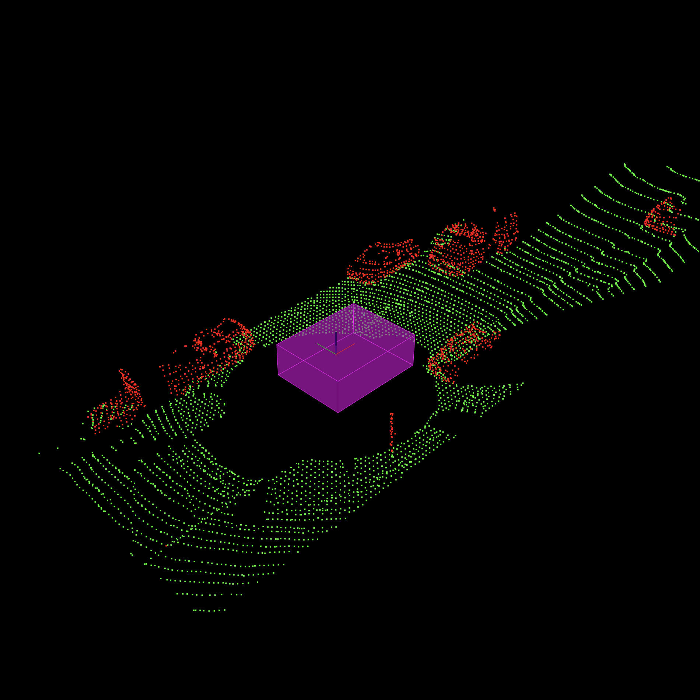

[Home](../../README.md) | Next: 

# Project 1: LiDAR Obstacle Detection

## Overview

In autonomous systems, such as robots or self-driving cars, LiDAR (Light Detection And Ranging) is commonly used as a way to accurately measure distances and create detailed three-dimensional maps of the surrounding environment. LiDAR targets surfaces with laser beams (photon pulses of a few nanoseconds) and measures the time it takes for the beams to bounce back; when surfaces are hit, Point Cloud Data (PCD) are generated.

In this initial project, I filter, segment, and cluster point clouds from LiDAR scans to detect incoming vehicles and obstacles within a driving lane. For each frame, I first reduce the density of the cloud using voxel grid and region of interest (ROI) techniques, which help simplify the data and keep only the most relevant information. I then separate the road plane from the obstacles using RANSAC, and get a clearer view of the environment. Next, I group together points that belong to the same objects via Euclidean clustering and KD-Trees. And finally, I encapsulate the clusters within both regular and PCA (Principal Component Analysis) bounding boxes, to get a visual representation of the detected items [Figure 1].

__Figure 1: PCA-Boxes-Enclosed Cluster Obstacles__


The project analyses driving scenes of increasing complexity:

1. __Simple Highway__: A sample environment used to test and fine-tune RANSAC, Euclidean Clustering, and Bounding Boxes.
2. __City Block (static)__: A static frame of real point cloud data from Carla, Udacity's self-driving car.
3. __City Block (streaming, linear)__: A stream of frames, of which case 2 is the initial one, depicting a linear road.
4. __City Block (streaming, non-linear)__: Tracking a cyclist through a dynamic, highly non-linear environment (not entirely explored).

## Project Structure

The directory structure tree for the project appears in Figure 2. In particular:

- `quiz` contains 2D/3D test implementations for RANSAC (executables: `quizRansac`, `quizRansac3d`) as well as KD-Trees and Euclidean clustering (`quizCluster`, `quizCluster3d`); these serve as prototypes for the main project;

- `src` includes main files `environment.cpp` (executable: `environment`) and `processPointCloud.cpp`, the latter holding all functions that manipulate point cloud data: voxel grid and region of interest filtering, RANSAC, KD-Tree and clustering 3D (logic for these is called from header files), regular and minimum (PCA-based) bounding boxes;

- `custom` has algorithmic implementations for KD-Tree creation and Euclidean clustering, as well as rendering options for all scenarios (in `options.h`, see next section);

- `render` contains helper functions for object rendering, while `sensors` holds, among the others, raw PCD files for different scenarios.

__Figure 2: Directory Structure Tree__

```bash
.
├── build
│   ├── ...
│   └── environment
├── CMakeLists.txt
└── src
    ├── custom
    │   ├── clustering.h
    │   ├── kdtree3d.h
    │   └── options.h
    ├── environment.cpp
    ├── processPointClouds.cpp
    ├── processPointClouds.h
    ├── quiz
    │   ├── cluster
    │   │   ├── build
    │   │   │   ├── ...    
    │   │   │   ├── quizCluster
    │   │   │   └── quizCluster3d
    │   │   ├── CMakeLists.txt
    │   │   ├── cluster.cpp
    │   │   ├── cluster3d.cpp
    │   │   └── headers
    │   │       ├── clustering.h
    │   │       ├── kdtree.h
    │   │       └── kdtree3d.h
    │   └── ransac
    │       ├── build
    │       │   ├── ...  
    │       │   ├── quizRansac
    │       │   └── quizRansac3d
    │       ├── CMakeLists.txt
    │       ├── ransac2d.cpp
    │       └── ransac3d.cpp
    ├── render
    │   ├── box.h
    │   ├── render.cpp
    │   └── render.h
    └── sensors
        ├── data
        │   └── pcd
        │       ├── data_1
        │       │   ├── ...
        │       │   └── 0000000021.pcd
        │       ├── data_2
        │       │   ├── ...
        │       │   └── 0000000153.pcd
        │       └── simpleHighway.pcd
        └── lidar.h
```

## Building and Running the Project

### Rendering Configurations

Point Cloud Library and associated Viewer have specific [build and rendering requirements](p1-preliminary-configs.md) on Ubuntu 20.04 (UTM QEMU 7.0 aarch64).

### Main File

```bash
cd /home/$whoami/workspace/udacity-rsend/projects/p1
mkdir build && cd build
cmake ..
make
./environment
```

### Quiz Files

```bash
cd /home/$whoami/workspace/udacity-rsend/projects/p1/src/quiz/{ransac|cluster}
mkdir build && cd build
cmake ..
make
./quiz{Ransac|Cluster}{|3d}
```

### Options

#### Main Options

These are contained in `environment.cpp` (`main` function) and render all available scenarios. If the first option is <code>false</code>, the other two are ignored.

<table>
    <thead>
        <tr>
            <th>Parameter</th>
            <th>Rationale</th>
        </tr>
    </thead>
    <tbody>
        <tr>
            <td><code>renderCityBlock</code></td>
            <td><code>true</code> to display "City Block", <code>false</code> to render "Simple Highway"</td>
        </tr>
        <tr>
            <td><code>streamCityBlock</code></td>
            <td><code>true</code> to continuously stream point cloud data in <code>data_1</code>, <code>false</code> to render the first frame only</td>
        </tr>
        <tr>
            <td><code>trackCyclist</code></td>
            <td><code>true</code> for highly non-linear tracking of a bicyclist and the surrounding objects using data contained in <code>data_2</code></td>
        </tr>
    </tbody>
</table>

#### Rendering Options

These are available in `custom/options.h` and render features for a particular scenario:

<table>
    <thead>
        <tr>
            <th>Parameter</th>
            <th>Rationale</th>
        </tr>
    </thead>
    <tbody>
        <tr>
            <td><code>renderScene</code></td>
            <td><code>true</code> to display highway and cars</td>
        </tr>
        <tr>
            <td><code>renderLidarScans</code></td>
            <td><code>true</code> to render LiDAR scans</td>
        </tr>
        <tr>
            <td><code>filterPointCloud</code></td>
            <td><code>true</code> to downsample the point cloud using voxel grid and region of interest filtering</td>
        </tr>
        <tr>
            <td><code>renderDataPoints</code></td>
            <td><code>true</code> to render colorless point cloud data points</td>
        </tr>
        <tr>
            <td><code>renderPlaneCloud</code></td>
            <td><code>true</code> to render inliers in green</td>
        </tr>
        <tr>
            <td><code>renderObstacleCloud</code></td>
            <td><code>true</code> to render obstacles (non-inliers) in red</td>
        </tr>
        <tr>
            <td><code>renderKdTree</code></td>
            <td><code>true</code> to render 3D KD-Tree in the Viewer (only recommended for "Simple Highway")</td>
        </tr>
        <tr>
            <td><code>renderClusters</code></td>
            <td><code>true</code> to render Euclidean Clustering on obstacle data</td>
        </tr>
        <tr>
            <td><code>renderEgoCarBox</code></td>
            <td><code>true</code> to render a box of the approximate Ego Car location in magenta</td>
        </tr>
        <tr>
            <td><code>renderBoxes</code></td>
            <td><code>true</code> to render regular bounding boxes around obstacle data</td>
        </tr>
        <tr>
            <td><code>renderMinimumXyAlignedBoxes</code></td>
            <td><code>true</code> to render XY-plane-aligned minimum bounding boxes</td>
        </tr>
    </tbody>
</table>

## Code Logic

### Voxel Grid

Reducing the density of a point cloud is essential in applications that require real-time handling of data, such as self-driving car software. The voxel grid technique helps achieve this purpose by downsampling, hence simplifying, the input cloud, optimizing data storage and processing requirements. A _voxel_ (volumetric pixel) is a cube that encapsulates and represents a single point in the three-dimensional space. The raw point cloud is divided into a cubic grid, and all points belonging to a particular cube are approximated by their _centroid_, a unique point with coordinates the means of all coordinates of the enclosed points: filtering is thus obtained by replacing the cloud of points in each cube with the corresponding centroid. For all exercises in this project, a side of 20 cm for the cubes was found to be a good trade-off between computational efficiency and detail preservation (ratio of ~100k to ~5k point per frame).

### Region Of Interest (ROI)

Region-based filtering consists, instead, in keeping only the core (a rectangular prism) of the driving environment discarding the edges, which have low significance for object detection and introduce unnecessary computational burden [1]. For "City Block", the region of interest (in meters) is: $X \in [-10; 30]$, $Y \in [-5; 6]$, $Z \in [-2; 1]$. That is, position the car roughly in the middle of the road, with ample view forward and enough backward, and since LiDAR is mounted on top of the vehicle, also enough at the bottom to keep the road plane itself.

A comparison between unfiltered and filtered clouds is shown in Figure 3.

<table>
  <tr>
  <td align="center"><b>Figure 3.A</b>: Raw (unfiltered) point cloud</td>
  <td align="center"><b>Figure 3.B</b>: Voxel grid (20 cm) and ROI -filtered point cloud</td>
  <tr>
  </tr>
  <tr>
    <td align="center"></td>
    <td align="center"></td>
  </tr>
</table>

### RANSAC

RANSAC (RANdom SAmple Consensus) [2], an iterative outlier detection method, is now used to distinguish between road and obstacles in the filtered point cloud. The maximum number of iterations is kept at 50 for all scenarios. For each iteration, three points are randomly selected from the cloud, and a plane fit to them [3]. A point is then labelled as "outlier" if its distance to the plane is greater than the specified threshold (15 cm in "City Block"). The iteration with the largest number of inliers to the plane is selected as the road, while all outliers are marked as obstacles [Figure 4.A].

### Euclidean Clustering

To discriminate among objects, points are then grouped together based on proximity using Euclidean clustering [4]. The nearest neighbor search is optimized via $k$-dimensional trees [5], a data structure that splits points hierarchically based on a different dimension at each level: at root by $x$, at levels 1 and 2 by $y$ and $z$ respectively, then at level 3 by $x$ again, and so on. Visually, the splits are planes (red, blue, green), each cutting their corresponding levels into two equal parts. Time complexity is greatly reduced with KD-Trees, because Euclidean distances for points that are not in a close-enough region to the target are not computed. The outcome of clustering appears in Figure 4.B.

<table>
  <tr>
  <td align="center"><b>Figure 4.A</b>: RANSAC</td>
  <td align="center"><b>Figure 4.B</b>: Euclidean Clustering</td>
  <tr>
  </tr>
  <tr>
    <td align="center"></td>
    <td align="center"></td>
  </tr>
</table>

### Bounding Boxes

Bounding boxes allow to visualize the boundaries an autonomous agent would encounter if it were to come into contact with an obstacle. In this project, two kinds of bounding boxes are considered: regular and minimum (PCA-based) ones.

#### Regular Bounding Boxes

For regular bounding boxes, the minimum and maximum coordinates across all dimensions (length $x$, width $y$, height $z$) define the vertices of the rectangular prism that will encapsulate the point cloud cluster. These boxes are computationally inexpensive, as only eight points are required to fit the cluster, but if the cloud extends diagonally the box will unnecessarily include a lot of empty space, with areas actually free to pass through marked as occupied [Figure 5.A].

#### Minimum Bounding Boxes

By incorporating rotation to precisely align with the shape of the point cloud, minimum bounding boxes [6] solve the issue of overfitting diagonal clusters [Figure 5.B]. One way to fit these boxes, explored in this project, is through Principal Component Analysis (PCA), which aligns the points to their axes of maximum variation. PCA-based bounding boxes are however computationally expensive and might be unstable, rotating unpredictably based on the shape of the detected point cloud across frames.

<table>
  <tr>
  <td align="center"><b>Figure 5.A</b>: Regular Bounding Boxes point cloud overfitting</td>
  <td align="center"><b>Figure 5.B</b>: PCA Bounding Boxes minimal fitting</td>
  <tr>
  </tr>
  <tr>
    <td align="center"></td>
    <td align="center"></td>
  </tr>
</table>

### PCA-Based Bounding Boxes

An implementation of PCA bounding boxes with Point Cloud Library is available at Codex Technicanum (CT) [8] [9]. Because that solution, applied to sorghum plants, includes rotation along all axes (X: roll, Y: pitch, Z: yaw), it cannot be readily applied to non-holonomic robots such as self-driving cars, which are constrained to lie on the XY-plane and only rotate along Z. Proper alignment of the boxes to the road plane is, however, a surprisingly difficult task. In my take on Udacity's "PCA Boxes Challenge", I slightly vary CT's algorithm to account for more robust retrieval and sorting of the orthogonal vectors in order to achieve a correct orientation of the bounding boxes. This approach is flowcharted in Figure 6. A detailed explanation of the algorithm will follow.

---

__Figure 6: PCA Boxes Flowchart__
<div style="display: flex; justify-content: center;">
  
</div>

---

#### Fully Implement CT Solution

Start by fully implementing Codex Technicanum's solution [9].

#### Singular Value Decomposition

From this algorithm, replace `Eigen::SelfAdjointEigenSolver` with `Eigen::JacobiSVD` and find the matrix of right-singular vectors $V$ (and corresponding singular values $S$) instead. Singular Value Decomposition (SVD) [10] is a robust generalization of eigendecomposition, and the singular vectors (equivalent to the eigenvectors) have signs which are more consistent and lead to better outcome visually when fitting the boxes.

#### Custom-Sort Singular Values

Before feeding $V$ to the 4D affine transformation matrix (top-left $3\times3$ block), sort in place its singular vector columns as follows: associate the first column of $V$ to dimension $x$ of the point cloud cluster, the second one to $y$, and the last one to $z$. Then, rank the dimensions of the clusters in descending order based on point ranges, and sort the singular vectors accordingly: for instance, if the point cloud is visually largest across $x$, then $z$, then $y$, arrange the columns as (0, 2, 1). This step is important because the point clouds in City Block largely vary in shape and direction: some are big, rectangular prisms with main axis $x$ (the cars), while others are almost uni-dimensional, vertical objects spreading along main axis $z$ (the side pole). When transposed to enter the 4D affine transformation matrix, the top row of $V$ would map to the most significant singular value, which is exactly what we want.

#### Ensure Validity of the Rotation Matrix

Once the singular vectors are sorted, ensure $V$ is still a valid rotation matrix. Among the other properties, it must satisfy $A \times A^T = I(3)$ and $\det(A) = 1$. I found that the former is generally preserved, but the latter is not, leading to a reflection matrix ($\det(A) = -1$). If this is the case, multiply the components of the least significant singular vector (which is not always the one associated with $z$) by $-1$. The line in CT's solution in which column 0 is crossed with column 1 to obtain column 2 can also be safely removed.

#### Get Rotation Matrix and Euler Angles from Quaternion

Once the bounding boxes are fitted to the clusters, they can be flattened. From the quaternion extract the rotation matrix and, from the latter, the Euler angles [11]. How these are retrieved is important: ZYX is not the same as XYZ. In this project, I chose ZYX.

#### Reconstruct the Original Object Flattened

Set roll (X) and pitch (Y) to zero, keep yaw (Z) as it was extracted. Feed the angles into basic 3D rotation matrices [12] and multiply them in a ZYX fashion to obtain a new rotation matrix for the box, aligned on the XY-plane. Finally, convert the rotation matrix into a new quaternion and pass it to the box.

A comparison between regular and PCA-based bounding boxes appears in Figure 7.

<table>
  <tr>
  <td align="center"><b>Figure 7.A</b>: Regular Bounding Boxes</td>
  <td align="center"><b>Figure 7.B</b>: PCA Bounding Boxes</td>
  <tr>
  </tr>
  <tr>
    <td align="center"></td>
    <td align="center"></td>
  </tr>
</table>

## Outstanding issues

- Calibration of parameters: RANSAC inliers threshold, Euclidean clustering point-proximity tolerance level, minimum number of points in a cluster (minimum number of points to detect the poles on the road, but also detect spurious clusters which are instead part of another larger cloud).
- Using PCA boxes in point 2, non-linear helps, but it is not enough especially because, due to the high variability of points in the point cloud clusters, the principal axes are not always correctly aligned, so additional corrective steps are needed.
- Ego car: Instead of extracting the point cloud associated to ego car at each frame, to avoid flickering and reduce computational burden, the very first frame is analysed and the location kept constant for all subsequent stills.


## Resources

1. https://knowledge.udacity.com/questions/609855
2. https://en.wikipedia.org/wiki/Random_sample_consensus
3. https://en.wikipedia.org/wiki/Euclidean_planes_in_three-dimensional_space
4. https://en.wikipedia.org/wiki/K-means_clustering
5. https://en.wikipedia.org/wiki/K-d_tree
6. https://en.wikipedia.org/wiki/Minimum_bounding_box_algorithms
7. https://en.wikipedia.org/wiki/Principal_component_analysis
8. http://codextechnicanum.blogspot.com/2015/04/find-minimum-oriented-bounding-box-of.html
9. https://github.com/Frogee/SorghumReconstructionAndPhenotyping/blob/master/boundingBox.h
10. https://en.wikipedia.org/wiki/Singular_value_decomposition
11. https://en.wikipedia.org/wiki/Conversion_between_quaternions_and_Euler_angles
12. https://en.wikipedia.org/wiki/Rotation_matrix#Basic_3D_rotations
13. Dimitrov, Knauer, Kriegel, Rote: "On the Bounding Boxes Obtained by Principal Component Analysis" (2014 Revision) - [Link](https://www.researchgate.net/publication/235758825_On_the_bounding_boxes_obtained_by_principal_component_analysis)

[Home](../../README.md) | Next: 
