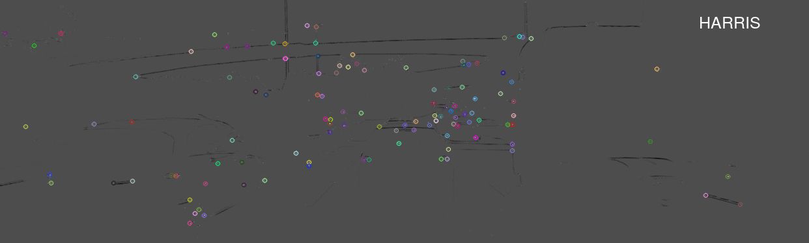
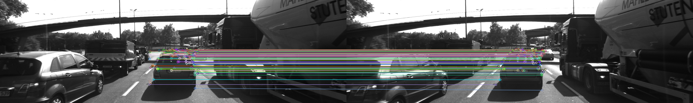
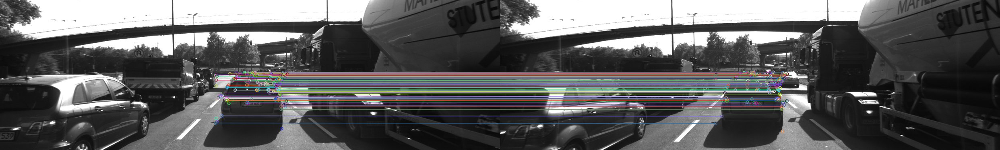
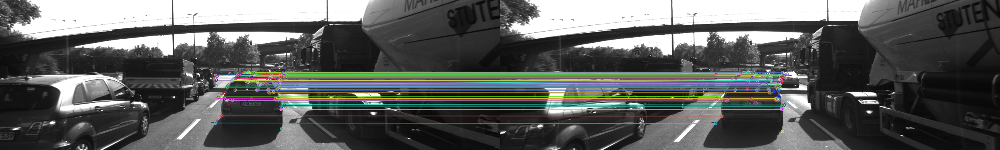

[Home](../../README.md) | Previous: [LiDAR Obstacle Detection](../p1/p1-lidar-obstacle-detection.md) | Next: 

# Project 2: Camera-Based 2D Feature Tracking

## Overview

__Figure 1: Keypoint Detectors' Output__


## Preliminary Considerations

This project was originally developed on a UTM QEMU 7.0 Virtual Machine running Ubuntu 20.04-5 LTS on Apple Silicon architecture (aarch64), and later ported to the Udacity workspace. It uses OpenCV 4.2.0, [built from source](https://github.com/federicomariamassari/udacity-rsend/blob/main/projects/p4/p4-preliminary-config.md#3-rebuild-opencv-from-source-with-patented-modules) to enable patented algorithms SIFT/SURF. For easier debugging and experimentation, the main parameters have been factored out in an [`Options` struct](https://github.com/federicomariamassari/udacity-sfend/blob/main/projects/p2/src/MidTermProject_Camera_Student.cpp#L10) and can be changed for a range of outcomes.

## Project Structure

The directory structure tree for the project appears in Figure 2. In particular:

- `src` includes main file `MidTermProject_Camera_Student.cpp` (executable: `2D_feature_tracking`) and `matching2D_Student.cpp`, the latter containing the logic for keypoint detection, description, matching, removal, as well as utilities such as loading an image into buffer and computing and printing statistics;
- `images` holds the input grayscale pictures;
- `analysis` contains a spreadsheet with output statistics from comparing detector-descriptor combinations.

__Figure 2: Directory Structure Tree__

```bash
.
├── build
│   ├── ...
│   └── 2D_feature_tracking
├── CMakeLists.txt
├── images
│   └── KITTI
│       └── 2011_09_26
│           └── image_00
│               └── data
│                   ├── 0000000000.png
│                   ├── ...
│                   └── 0000000009.png
├── analysis
│   └── performance_evaluation.xls
└── src
    ├── dataStructures.h
    ├── matching2D.hpp
    ├── matching2D_Student.cpp
    └── MidTermProject_Camera_Student.cpp
```

## Mid-Term Report

### MP.1: Data Buffer Optimization

A data ring buffer guarantees efficient memory management by limiting the number of images simultaneously present in the holding data structure, preventing the structure from growing excessively in size. Here, the buffer is a C++ vector with maximum size two; if the vector is full, we erase the earliest pushed-back image first (FIFO), then add the next element [1]. Time complexity is linear on the element erased and linear on moving the remaining element from position 1 to position 0 [2]; one can even say both operations occur in constant time, since the deleted object is always the first one with no search involved, and a one-place move is performed. The data buffer logic is encapsulated in a custom function [`loadBufferIntoFrame`](https://github.com/federicomariamassari/udacity-sfend/blob/main/projects/p2/src/matching2D_Student.cpp#L362), which is then [called in the main file](https://github.com/federicomariamassari/udacity-sfend/blob/main/projects/p2/src/MidTermProject_Camera_Student.cpp#L142).

### MP.2: Keypoint Detection

Keypoint detection, description, matching, and selection are implemented in `matching2D_Student.cpp`. The Harris and Shi-Tomasi detectors have _ad hoc_ methods, while SIFT (and SURF), FAST, ORB, BRISK, and AKAZE are all included in `detKeypointsModern`. To provide a uniform interface, wrapper function [`detectKeypoints`](https://github.com/federicomariamassari/udacity-sfend/blob/main/projects/p2/src/matching2D_Student.cpp#L386) is also included and [called from `main`](https://github.com/federicomariamassari/udacity-sfend/blob/main/projects/p2/src/MidTermProject_Camera_Student.cpp#L150). Algorithm selection is performed via string comparison, using `std::string::compare` instead of `==` to both conform with the starter code and to allow for input case-insensitivity (source: Udacity GPT). Harris corner detection and non-maxima suppression are based on the Udacity solution [3]; for modern algorithms, which are plugged in the generic `cv::FeatureDetector` class, the main references are [4] and [5]. To improve readability, arguments are not explicitly passed to the function signatures if they use the default values; instead, reference to the official documentation is made in the code.

SURF is also included (but analysed separately), as it was the required method for project P4 [Map My World](https://github.com/federicomariamassari/udacity-rsend/blob/main/projects/p4/p4-map-my-world.md) of Udacity's Robotics Software Engineer Nanodegree and I was curious to understand how it would compare to the other algorithms.

### MP.3: Keypoint Removal

For this task, template class `cv::Rect` [6] is used to remove all keypoints outside an area in pixels centered on the preceding vehicle (x=535, y=180, width=180, height=150). All keypoints whose coordinates belong to the rectangle are pushed back in a new vector, which is then reassigned to the original object. It is worth mentioning that the pre-defined area includes the side mirror of a vehicle on the left, as well as the shadow of the preceding car itself, with relevant implications for the analysis. The keypoint removal logic is placed in custom method [`focusOnArea`](https://github.com/federicomariamassari/udacity-sfend/blob/main/projects/p2/src/matching2D_Student.cpp#L408), which is then [called in the main file](https://github.com/federicomariamassari/udacity-sfend/blob/main/projects/p2/src/MidTermProject_Camera_Student.cpp#L154).

### MP.4: Keypoint Descriptors

Descriptors SIFT (and SURF), BRIEF, ORB, FREAK, and AKAZE are implemented, with default arguments, from [4] and [5]. They complement the already available BRISK. Similarly to the detectors' case, the descriptors are plugged in the generic class `cv::DescriptorExtractor`, which provides a clean interface. Exceptions are raised in case of detector/descriptor incompatibilities, such as SIFT and ORB, or AKAZE and everything else [7].

### MP.5: Descriptor Matching

The main reference for matching is [8], with abstract class `cv::DescriptorMatcher` used as base for all matchers. Validation criteria are added to both Brute Force (part of the starter code) and FLANN: for Brute Force, by ensuring that the Hamming distance is only applied to binary algorithms, using instead the L2-norm (vector norm) for Histogram Of Gradients -based methods SIFT and SURF (having previously labelled them as such) [9]; for FLANN, by converting the input descriptor source and reference into 32-bit floating point numbers ahead of the processing step [10].

For the k-Nearest Neighbor selector, the main source is [11].

### MP.6: Description Distance Ratio

The implementation of the description distance ratio for k-Nearest Neighbors is taken from Udacity's solution to [12].

### MP.7: Performance Evaluation 1

Table 1 contains statistics on the distribution of keypoints' neighborhood size — the diameter of the region around each keypoint that is considered when computing the associated descriptor [13] — for all detectors analysed. For most detectors, default parameter values were kept for fair comparison and as they seem to strike a good balance between computational time and number of keypoints detected. Only for FAST, `threshold` was increased to 20 (from default 10) because this adjustment, despite leading to far fewer keypoints, greatly improved accuracy.

__Number of keypoints.__ BRISK, FAST, and AKAZE detect the largest amount of keypoints in the region, followed by SIFT, SHITOMASI, ORB, and by a long distance, HARRIS. BRISK and FAST are particularly effective in the given dataset, with the latter even detecting twice as many features in total (4094) if default parameter values are kept. SURF is also excellent, ending at third place with a total of 2150 keypoints.

__Distribution shape.__ The distribution of neighborhood size is constant (i.e., standard deviation = 0) for HARRIS, SHITOMASI, and FAST. For the first two it is dictated by, respectively, `blockSize` $\times$ `apertureSize` and `blockSize`. For FAST, it is fixed by construction, as 7 is the diameter of a circle with a 16-pixel circumference [14] [15]. The distribution is variable for other detectors, and the spread around the mean (as measured by standard deviation, range, and IQR) is greatest for ORB and BRISK, suggesting keypoint detection across a broader range of sizes for these two algorithms.

__Neighborhood size.__ In general, ORB and BRISK make use of the largest local context to describe a feature (i.e., include more information). This tendency is shown by the higher median (a measure robust to outliers) values of 44.64 and 15.5217 pixels respectively, and by the mode (the most frequently-occurring value in a distribution) coinciding with the maximum value for both. By contrast, FAST, AKAZE, and SIFT tend to consider much smaller regions, although for the latter the mode is ~43 pixels. SURF is also highly descriptive, with a median value of 21 and mode of 128 pixels.

__Table 1: Distribution of Keypoints' Neighborhood Size__

| Metrics | Harris | Shi-Tomasi | FAST | BRISK | ORB | AKAZE | SIFT | SURF |
|:----------|------:|------:|------:|------:|------:|------:|------:|------:|
| Total number of keypoints | 247 | 1179 | 2207 | 2762 | 1161 | 1670 | 1386 | 2150 |
| Keypoints/image (lower bound) | 24 | 117 | 220 | 276 | 116 | 167 | 138 | 215 |
| Avg keypoint detection time* (ms) | 5.13568 | 4.11741 | 0.862544 | 38.2281 | 4.34509 | 41.7808 | 40.887 | 17.0413 |
| Mean | 6 | 4 | 7 | 21.9444 | 55.9928 | 7.69915 | 5.03739 | 28.2967 |
| Median | 6 | 4 | 7 | 15.5217 | 44.64 | 5.70819 | 3.19932 | 21 |
| Mode | 6 | 4 | 7 | 72 | 111.079 | 22.8328 | 42.8487 | 128 |
| Standard deviation | 0 | 0 | 0 | 14.6207 | 25.1258 | 3.53831 | 5.98752 | 19.6608 |
| Min | 6 | 4 | 7 | 8.4 | 31 | 4.8 | 1.79669 | 10 |
| Max | 6 | 4 | 7 | 72 | 111.079 | 27.1529 | 51.7024 | 128 |
| Range | 0 | 0 | 0 | 63.6 | 80.0786 | 22.3529 | 49.9057 | 118 |
| 25th percentile | 6 | 4 | 7 | 12.3061 | 37.2 | 5.70819 | 2.1767 | 16 |
| 75th percentile | 6 | 4 | 7 | 27 | 77.1379 | 8.07261 | 4.83003 | 30 |
| IQR | 0 | 0 | 0 | 14.6939 | 39.9379 | 2.36441 | 2.65333 | 14 |

(*) Single experiment.

### MP.8: Performance Evaluation 2

[`performance_evaluation.xls`](https://github.com/federicomariamassari/udacity-sfend/tree/main/projects/p2/analysis) contains breakdowns of keypoint matches, per image pair and total, for both DES_BINARY and DES_HOG. The lists are sorted in descending order by total time, then by matching ratio (the proportion of matches over the sum of matches and non-matches). For SIFT (and SURF), DES_HOG is always used, even when DES_BINARY is selected. For this exercise, the matcher type is set to brute-force (MAT_BF), while the selector to $k$-Nearest Neighbors (SEL_KNN, $k$ = 2), with a descriptor distance ratio of 0.8.

Overall, DES_BINARY leads to several more feature matches (~100+ on average), showing that the Hamming distance is in general a less strict discriminant as compared to the L2-norm. For this reason, I will mostly focus on results from the former.

Combinations BRISK-BRIEF (1704) and BRISK-SIFT (1656) produce the largest number of matched features, albeit with average accuracy (~65-68%), as is the case for all pairs where BRISK is the detector. The excellent FAST-BRIEF (1601) and FAST-ORB (1575) follow, but with much higher accuracy (~80%). Among the worst performers are the combinations where a HOG-based detector is paired with a binary descriptor, for example SIFT-BRISK or SIFT-FREAK (accuracy: less than 50%). Interestingly, when DES_HOG is chosen as default descriptor group, binary-only combinations like BRISK-ORB or BRISK-FREAK become some of the poorest instead (matching ratio ~35-45%).

### MP.9: Performance Evaluation 3

The same spreadsheet also contains running time statistics for each detector-descriptor set. Data are available separately for each phase (detection and description), as well as an aggregate. Computation time difference between DES_BINARY and DES_HOG is quite negligible. A caveat of this analysis is that statistics are collected on a single experiment, so there will be some variability across repetitions (although the ranking is stable).

Table 2 ranks my top detector-descriptor combinations based on total computation time and accuracy (as measured by the matching ratio). In making the choice, I accounted for the fact that keypoint detection on objects different from the preceding vehicle—an issue common to all pairs—mostly depends on the pre-defined rectangle dimensions (see MP.3), and that speed is of essence in real-time applications such as tracking time-to-collision. The latter justifies my pick for third place.

FAST-BRIEF takes the crown as the top-performing combination (11.75 ms total time, 1601 matches, 81% matching ratio), followed by FAST-ORB (15.60 ms, 1575 matches, ~80% matching ratio), and FAST-BRISK (19.73 ms, 1285 matches, ~65% matching ratio). For this particular application, FAST appears to be the best detector, while BRIEF the best descriptor. Somewhat unexpectedly, binary methods outperform HOG-based ones in terms not only of speed, but also accuracy. Worth to mention is also SHITOMASI-SIFT (DES_HOG), which achieves the highest matching ratio (~87%) across the board.

__Table 2: Top 3 Detector-Descriptor Combinations (DES_BINARY)__

| Rank | Detector | Descriptor | Total Matches | Matching Ratio (%) | Detection Time* | Description Time* | Total Time* |
|:----:|:---------|:-----------|--------------:|-------------------:|----------------:|------------------:|------------:|
| 1 | FAST | BRIEF | 1601 | 80.57 | 8.33279 | 3.41294 | 11.7457 |
| 2 | FAST | ORB | 1575 | 79.27 | 8.29375 | 7.30317 | 15.5969 |
| 3 | FAST | BRISK | 1285 | 64.67 | 8.78666 | 10.9405 | 19.7271 |

(*) In milliseconds (UTM VM on MacBook Pro M1 Max, 8 CPU cores, 32GB RAM).

Figure 3 displays the output from the top 3 detector-descriptor combinations (frames 6-7).

__Figure 3: FAST-BRIEF (Top), FAST-ORB (Middle), FAST-BRISK (Bottom) Feature Matching__




## Resources

1. https://knowledge.udacity.com/questions/644337
2. https://cplusplus.com/reference/vector/vector/erase/
3. Harris Corner Detection, Tracking Image Features Lesson 5, Udacity Sensor Fusion Nanodegree
4. [OpenCV 4.2.0: Feature Detection and Description](https://docs.opencv.org/4.2.0/d5/d51/group__features2d__main.html)
5. [OpenCV 4.2.0: Non-free 2D Features Algorithms](https://docs.opencv.org/4.2.0/d2/dca/group__xfeatures2d__nonfree.html)
6. [OpenCV 4.2.0: cv::Rect_< _Tp > Class Template Reference](https://docs.opencv.org/4.2.0/d2/d44/classcv_1_1Rect__.html)
7. https://knowledge.udacity.com/questions/105392
8. [OpenCV 4.2.0: Descriptor Matchers](https://docs.opencv.org/4.2.0/d8/d9b/group__features2d__match.html)
9. [OpenCV 4.2.0: cv::BFMatcher Class Reference](https://docs.opencv.org/4.2.0/d3/da1/classcv_1_1BFMatcher.html)
10. https://knowledge.udacity.com/questions/211123
11. [OpenCV 4.2.0: cv::DescriptorMatcher Class Reference](https://docs.opencv.org/4.2.0/db/d39/classcv_1_1DescriptorMatcher.html)
12. Exercise - Descriptor Matching, Tracking Image Features Lesson 12, Udacity Sensor Fusion Nanodegree
13. [OpenCV 4.2.0: cv::KeyPoint Class Reference](https://docs.opencv.org/4.2.0/d2/d29/classcv_1_1KeyPoint.html)
14. https://knowledge.udacity.com/questions/1021073
15. [OpenCV 4.2.0: FAST Algorithm for Corner Detection](https://docs.opencv.org/4.2.0/df/d0c/tutorial_py_fast.html)

[Home](../../README.md) | Previous: [LiDAR Obstacle Detection](../p1/p1-lidar-obstacle-detection.md) | Next: 