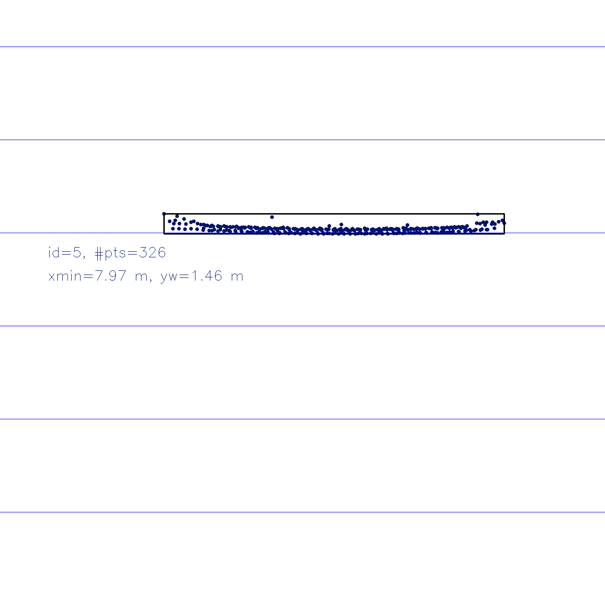
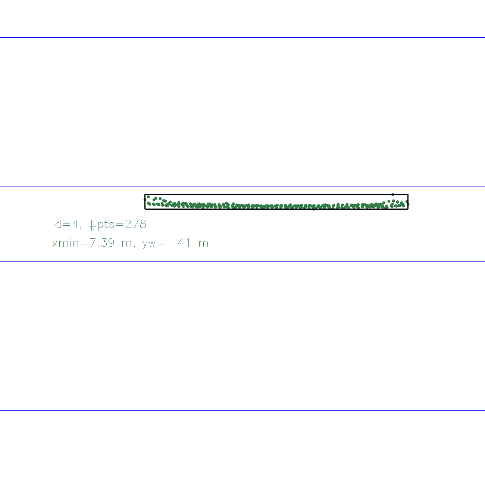
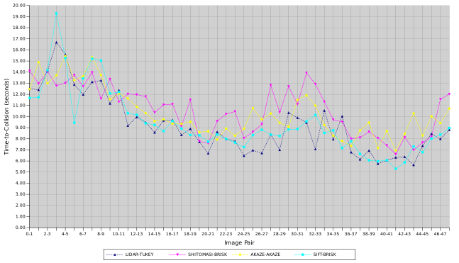

[Home](../../README.md) | Previous: [Camera-Based 2D Feature Tracking](../p2/p2-camera-based-2d-feature-tracking.md) | Next: 

# Project 3: Track an Object in 3D Space

## Overview

The final project of the camera course involves fusing data from LiDAR and camera sensors to reliably estimate time-to-collision (TTC) with a vehicle in front, in the context of a Collision Detection System (CDS). After detecting and classifying the objects on the road using deep-learning framework YOLOv3 (You Only Look Once) [Figure 1], I identify the LiDAR points and keypoint matches that fall inside the region of interest (ROI) of the preceding vehicle's 2D bounding box across consecutive frame pairs, and use these to compute robust TTC estimates for both LiDAR and camera [Figure 2]. All tasks are timed to monitor their efficiency.

__Figure 1: YOLOv3 2D Bounding Boxes__


__Figure 2: Time-to-Collision Estimates (Tukey, AKAZE-AKAZE)__


## Project Structure

The directory structure tree for the project appears in Figure 3. In particular:

- `src` includes main file `FinalProject_Camera.cpp` (executable: `3D_object_tracking`) and `camFusion_Student.cpp`, which contains the logic for 3D object tracking and TTC computation;
- `dat` holds pre-trained YOLOv3 config files, weights, and COCO dataset class names;
- `images` has input camera frames and LiDAR point cloud binaries;
- `analysis` contains a spreadsheet with output statistics on LiDAR and camera-based TTC combinations (FP.5, FP.6).

__Figure 3: Directory Structure Tree__

```bash
.
├── analysis
│   └── p3_performance_evaluation.xls
├── build
│   ├── ...
│   └── 3D_object_tracking
├── CMakeLists.txt
├── dat
│   └── yolo
│       ├── coco.names
│       ├── yolov3.cfg
│       └── yolov3.weights
├── images
│   └── KITTI
│       └── 2011_09_26
│           ├── image_02
│           │   └── data
│           │       ├── 0000000000.png
│           │       ├── ...
│           │       └── 0000000077.png
│           └── velodyne_points
│               └── data
│                   ├── 0000000000.bin
│                   ├── ...
│                   └── 0000000077.bin
└── src
    ├── camFusion.hpp
    ├── camFusion_Student.cpp
    ├── dataStructures.h
    ├── FinalProject_Camera.cpp
    ├── lidarData.cpp
    ├── lidarData.hpp
    ├── matching2D.hpp
    ├── matching2D_Student.cpp
    ├── objectDetection2D.cpp
    └── objectDetection2D.hpp
```

### Options

Options can be set from within the `Options` struct in the main file.

<table>
    <thead>
        <tr>
            <th>Type</th>
            <th>Parameter</th>
            <th>Default value</th>
            <th>Explanation</th>
        </tr>
    </thead>
    <tbody>
        <tr>
            <td rowspan=1><b>Input data options</b></td>
            <td><code>bExtraAccuracy</code></td>
            <td><code>false</code></td>
            <td><code>true</code> for more accurate YOLOv3 blob size $(448 \times 448)$, <code>false</code> for default $(416 \times 416)$* [3]</td>
        </tr>
        <tr>
            <td rowspan=8><b>Visualisation and output options</b></td>
            <td><code>bVisYoloBoundingBoxes</code></td>
            <td><code>false</code></td>
            <td><code>true</code> to show YOLOv3 bounding boxes, COCO names, and confidence levels for each frame</td>
        </tr>
        <tr>
            <td><code>bVisLidarTopView</code></td>
            <td><code>false</code></td>
            <td><code>true</code> to display LiDAR top-view perspective, <code>false</code> to skip</td>
        </tr>
        <tr>
            <td><code>bStopAtLidarTopView</code></td>
            <td><code>false</code></td>
            <td>wrapper around the <code>continue</code> statement; <code>true</code> to cycle through all LiDAR top-views (if <code>bVisLidarTopView = true</code>), <code>false</code> to proceed with time-to-collision calculation</td>
        </tr>
        <tr>
            <td><code>bVisFinalOutput</code></td>
            <td><code>true</code></td>
            <td><code>true</code> to view final output image with superimposed time-to-collision estimates</td>
        </tr>
        <tr>
            <td><code>bVisKeypointsOverlay</code></td>
            <td><code>true</code></td>
            <td><code>true</code> to additionally superimpose keypoints on preceding vehicle bounding box</td>
        </tr>
        <tr>
            <td><code>bSaveYoloBBFrames</code></td>
            <td><code>false</code></td>
            <td><code>true</code> to write YOLOv3 bounding box frames inside the current working directory (if <code>bVisYoloBoundingBoxes = true</code>)</td>
        </tr>
        <tr>
            <td><code>bSaveLidarTopView</code></td>
            <td><code>false</code></td>
            <td><code>true</code> to write LiDAR top-views inside the current working directory (if <code>bVisLidarTopView = true</code>)</td>
        </tr>
        <tr>
            <td><code>bSaveOutputFrames</code></td>
            <td><code>false</code></td>
            <td><code>true</code> to write output frames inside the current working directory (if <code>bVisFinalOutput = true</code>)</td>
        </tr>
        <tr>
            <td rowspan=4><b>Outlier detection and diagnostics options</b></td>
            <td><code>FilteringMethod</code></td>
            <td><code>TUKEY</code></td>
            <td>Outlier filtering method. Either <code>TUKEY</code> for Tukey's fences [4] or <code>EUCLIDEAN_CLUSTERING</code> [6]</td>
        </tr>
        <tr>
            <td><code>bLimitKpts</code></td>
            <td><code>false</code></td>
            <td><code>true</code> to limit the number of keypoints. Helpful to debug and learn, but will introduce NaN values in time-to-collision calculations</td>
        </tr>
        <tr>
            <td><code>bRenderClusters</code></td>
            <td><code>false</code></td>
            <td><code>true</code> to render 3D LiDAR point clusters</td>
        </tr>
        <tr>
            <td><code>bShowRemoved</code></td>
            <td><code>true</code></td>
            <td><code>true</code> to also display colorless outliers (if <code>bRenderClusters = true</code>)</td>
        </tr>
    </tbody>
</table>

(*) Set to `true` to avoid spurious bounding boxes if `imgEndIndex` >= 48.

## Final Report

### FP.1: Match 3D Objects

The main reference for this task is [1]. To match bounding box pairs, I create a map object in which, for each element, the key will be a pair of bounding box indices (associated to the previous and current frames, respectively) and the value a counter of all occurrences of such key pair among the keypoint matches. For each match, after extracting the respective feature points in both frames [2], I first loop through all the bounding boxes in the query (previous) image to check which of them contains the related point; if a correspondence is found, I then run through all bounding boxes in the train (current) image to find the ones which also include the associated point. For those pairs where both conditions are met, the counter is incremented. The default overlap threshold value of 0.4 for the YOLOv3 non-maxima suppression algorithm does not guarantee a keypoint is contained in one and only one bounding box, so I avoid early termination once a correspondence is found despite the increase in computational time.

Once the map is populated, the query-train index pairs for which the counter is largest (one for each query bounding box index) are kept. Many-to-one cases in which multiple previous bounding boxes are associated to the same current one are not removed, as they do not seem to distort the analysis (for example, they are not related to cases of "spurious bounding boxes" [3] mentioned further below). The object-matching logic is found in [`matchBoundingBoxes`](https://github.com/federicomariamassari/udacity-sfend/blob/main/projects/p3/src/camFusion_Student.cpp#L131) and called from the [main file](https://github.com/federicomariamassari/udacity-sfend/blob/main/projects/p3/src/FinalProject_Camera.cpp#L221).

### FP.2: Compute LiDAR-based TTC

LiDAR time-to-collision logic is handled by [`computeTTCLidar`](). Extreme or otherwise unreliable data are discarded using one of the available filtering methods as input to function [`removeOutliers`](). TTC is then given by the Constant Velocity Model (CVM) formula, with $\tilde{x}$ ($x$ tilde) the median of all x-coordinates of the usable points (a proxy for distance $d$):

$$
\text{TTC}_ {\text{CVM}} = d_1 \times \frac{\Delta t}{d_0 - d_1} = \tilde{x}_{\text{curr}} \times \frac{\Delta t}{\tilde{x} _{\text{prev}} - \tilde{x} _{\text{curr}}}
$$

### Outlier Removal

Outlier detection and removal is provided in two flavours: Tukey's fences [4] and Euclidean clustering [5] [6]. Each option can be selected from the [`FilteringMethod`]() enum class. Custom rendering function [`renderClusters`](), valid for both methodologies, is also included for debugging and exploratory purposes, and can be enabled by setting `bRenderClusters = true`. (Colorless) outliers can be displayed with `bShowRemoved = true`.

#### Tukey's Fences

This option filters out as outliers all points whose x-coordinate (measuring the distance between ego and the preceding vehicle) is outside the interval $[Q_1 - 1.5\times IQR; Q_3 + 1.5\times IQR]$, where $Q_1$ and $Q_3$ are, respectively, the first and third quartiles (25th and 75th percentiles), computed via custom function [`percentile`](), and $IQR = Q_3 - Q_1$ is the interquartile range. This method produces a stable time-to-collision estimate fast and effectively, and is set as the default option.

#### Euclidean Clustering

An alternative option, which also considers dimensions $y$ and $z$ in the outlier detection phase, is Euclidean clustering [5]. The main reference for implementation (which used Point Cloud Library instead of OpenCV), is [6]. Instead of choosing the cluster with the largest number of points to compute TTC, as [5] suggests, I remove those clusters whose size is smaller than a predefined threshold `minSize` (main options) and use the remainder. Euclidean clustering is considerably slower than Tukey's fences (~10x with default values), hence harder to justify, in the current implementation, for real-time applications. The below parameters play a role in fine-tuning the algorithm:

| Parameter  | Default value | Explanation |
| :--------- | :------------ | :-----------|
| `knn`      | 5             | Number $k$ of neighbors to include at each radius search. Set $k > 3$ to ensure at least one new point is considered at each iteration (there will be duplicates), but not too large to avoid excessive increase in computational time. |
| `radius`   | 0.12          | Distance tolerance to query point for the neighborhood search. This value will be squared (L2-norm) [7]. |
| `minSize`  | 15            | Minimum cluster size. Clusters smaller than this threshold will be discarded as outliers. |
| `maxSize`  | 600           | Maximum cluster size. Clusters larger than this threshold will also be discarded. |

A visual comparison of the two algorithms using `renderClusters` is given in Figure 4 (white points do not enter the TTC calculation).

__Figure 4. LiDAR Outlier Detection by Algorithm__
<table>
  <tr>
  <td align="center"><b>Figure 4.A</b>: Tukey's fences</td>
  <td align="center"><b>Figure 4.B</b>: Euclidean Clustering</td>
  <tr>
  </tr>
  <tr>
    <td align="center"></td>
    <td align="center"></td>
  </tr>
</table>

### FP.3: Associate Keypoint Correspondences with Bounding Boxes

To establish a connection between the YOLOv3 bounding boxes and the enclosed keypoints, I proceed as follows. For each match, I extract the keypoint descriptors for both the previous and the current frame; if the region of interest (ROI) of the latter [8] contains the associated feature, I compute the Euclidean distance (L2-norm) between the train and the query keypoints and preliminary push it back into a vector. As we expect a rigid transformation of the preceding vehicle [9] given the focus on a straight ego lane, I then remove all enclosed matches whose distance exceeds 1.5 times the median (the mean is not a robust enough estimator). The remaining correspondences, both matches and keypoints, are finally assigned back to their respective `BoundingBox` attributes. This logic is handled by [`clusterKptMatchesWithROI`]().

### FP.4: Compute Camera-based TTC

The main reference for camera-based time-to-collision computation is the solution to [10]. `minDistance` (the minimum threshold to avoid ambiguous matches when keypoints are too close or have too similar descriptors) is kept as 100, as both smaller and larger values were found to cause large swings in the final TTC estimates [11]. Tukey's fences are then applied to the filtered heights ratios before using the median ratio as input to time-to-collision.

### FP.5: Performance Evaluation 1

LiDAR TTC estimates are generally stable, decreasing smoothly over time (especially in later frames) as ego vehicle approaches the car in front. There are, however, some exceptions, largely due to the simplistic nature of the Constant Velocity Model (CVM) adopted.

__Median values are too close.__ Small variations in the denominator $\tilde{x} _{\text{prev}} - \tilde{x} _{\text{curr}}$ can cause large swings in TTC estimates, especially when the difference between the two medians (which are close to each other by construction) approaches 0. Ironically, less robust statistics like the mean, which is heavily affected by outliers, would lead to more stable TTC values under CVM in these cases. Take, for instance, image pairs 1-2 and 3-4 (with outliers removed using Tukey's fences). $\tilde{x}_1$ = 8.009 and $\tilde{x}_2$ = 7.945, so $\tilde{x}_1 - \tilde{x}_2$ = 0.064 and TTC = 12.41 seconds. However, $\tilde{x}_3$ = 7.889 and $\tilde{x}_4$ = 7.842, so $\tilde{x}_3 - \tilde{x}_4$ = 0.047 and TTC = 16.69 seconds. Hence, a reduction in the denominator of less than 0.02 causes a spike in TTC of more than 4 seconds. I could think of two ways to mitigate the problem. One is to decrease the sampling frequency, setting for example `imgStepWidth = 4` (2.5 Hz), which would remove some noise due to nearly identical observations. Another one is to fine-tune the Euclidean Clustering algorithm to filter out possible outliers along the $y$ and $z$ dimensions as well, so as to make the median values less similar. For example, with `knn = 4` and `radius = 0.3`, $\tilde{x}_3$ = 7.890 and $\tilde{x}_4$ = 7.842, so $\tilde{x}_3 - \tilde{x}_4$ = 0.048 and TTC = 16.34 seconds.

It is also possible to ballpark estimate the TTC by looking at the LiDAR top-view perspectives across subsequent frames. Figure 5 considers a time span of 1 second (10 Hz) between frame 0 (5.A) and frame 10 (5.B). Each blue line, starting from the bottom, represents a 2-meter mark, so that in frame 0 the tailgate of the preceding vehicle is at ~8 meters from ego, while in the frame 10 it is at ~7 meters and 40 cm. At current speed, distance would decrease by 6 meters every 10 seconds, so that the point of impact would occur approximately between 12 and 14 seconds, making any TTC value above 16 seconds implausible.

__Figure 5: LiDAR Top-View Perspectives__
<table>
  <tr>
  <td align="center"><b>Figure 5.A</b>: Frame 0</td>
  <td align="center"><b>Figure 5.B</b>: Frame 10</td>
  <tr>
  </tr>
  <tr>
    <td align="center"></td>
    <td align="center"></td>
  </tr>
</table>

__Vehicles are still.__ At the extreme, when both ego and the preceding vehicle are stationary, TTC estimates swing dramatically between large positive and large negative values based on negligible and almost random variations in the median values for both query and train frames. Large positive values make sense: if both vehicles are still, the impact would never occur (in other words, TTC is infinite). Negative ones, however, do not. Figure 6 clearly displays this oscillating behaviour. `bExtraAccuracy = true` to avoid spurious bounding boxes. The green dots, which do not belong to the vehicle in front, are filtered out from TTC calculation.

__Figure 6: Erratic TTC behaviour when vehicle is still__


__Size and shape of the points' distribution varies across frames.__ Median values and TTC estimates can also be affected by the varying sample size and shape (skewness, excess kurtosis) of the distribution of LiDAR points across frames. This behaviour is apparent in frames 10-12. Sample size is post outliers filtering. Negatively (resp., positively) -skewed distributions have more points on the LHS (RHS) of the preceding vehicle [12]; distributions with negative (resp., positive) excess kurtosis are thin-tailed or platykurtic (fat-tailed, leptokurtic) [13]. From these higher-order moments, one can see the distributions of points in pictures 10-11 are closer in shape than those in frames 11-12, so the median difference of the former is smaller and TTC larger [Figure 7].

| Frame | Sample size | Median (x-coordinate) | Median difference | TTC | Skewness | Excess kurtosis | Points distribution |
|------:|------------:|----------------------:|------------------:|----:|---------:|----------------:|:--------------------|
| 10 | 266 | 7.486 | - | - | 0.0979933 | -0.265167 | Positively-skewed, platykurtic |
| 11 | 283 | 7.426 | 0.06 | 12.376679 | -0.343114 | -0.242634 | Negatively-skewed, platykurtic |
| 12 | 293 | 7.346 | 0.08 | 9.182509 | 0.360459 | -0.17982 | Positively-skewed, platykurtic |

__Figure 7: Points distribution and TTC (Frames 10-12)__


__Spurious bounding boxes.__ Keeping the default YOLOv3 blob size $(416 \times 416)$ for images 48-77 introduces an extra bounding box in each frame which severely distorts TTC calculations [Figure 8] [3]. Slightly increasing the size to $(448 \times 448)$ solves the problem. Interestingly, choosing larger values like $(608 \times 608)$ reintroduces the issue, maybe because the larger bounding box also becomes more accurate.

__Figure 8: Extra bounding box with blob size 416 x 416 (Frame 48)__


### FP.6: Performance Evaluation 2

To determine the best detector-descriptor pair for the camera-based time-to-collision, I rely on three criteria:

1. Proximity to the ground truth proxy (LiDAR time-to-collision, Tukey);
2. Speed of the detector-descriptor combination;
3. Relatively decreasing monotonicity of the time-to-collision estimate.

I consider all frames until the vehicle is nearly stationary (48), at which point the LiDAR TTC estimate becomes unreliable since the previous and current median values are so close to each other that their difference (at the denominator) is almost zero, leading to sudden spikes in both directions in the TTC output. `bExtraAccuracy = false` as per default. The results are available in [`p3_performance_evaluation.xls`](./analysis/p3_performance_evaluation.xls).

Among all possible pairs, three combinations are shortlisted: SIFT-BRISK, AKAZE-AKAZE, and SHITOMASI-BRISK. If SURF is also included, then SURF-ORB.

__Winner.__ Overall, the best combination appears to be SIFT-BRISK. Although quite slow (~50 ms per frame), it performs very well in terms of both criteria (1) and (3) [Figure 9]. It is true that TTC estimates swing quite widely in the first few frames, being +/- 2 seconds off, but they soon align with the ground truth proxy, leaving enough time for ego car to break, while still at a safe distance from the preceding vehicle. The assumption that the mid-to-last segment of the road is the most impactful to avoid collision depends, however, on the initial speed of ego car. If it is too high, the algorithm might be too slow to react, hence valid alternatives would be SURF-ORB (~25-30 ms), if considered, or SHITOMASI-BRISK (~12-15 ms). Both would allow to brake sooner and in a smoother way.

__Runner-Ups.__

AKAZE-AKAZE is another great combination, but it has a few shortcomings: it is the slowest among the pairs considered (~70-80 ms per frame) and it tends to overestimate time-to-collision in the mid-to-last segment, raising the chance of bumping into the vehicle in front.

__Figure 9: Camera-based Time-to-Collision vs LiDAR ground truth proxy__


__Figure 10: SIFT-BRISK vs SURF-ORB vs LiDAR ground truth proxy__


## Resources

1. https://knowledge.udacity.com/questions/570553
2. https://docs.opencv.org/4.2.0/d4/de0/classcv_1_1DMatch.html
3. https://knowledge.udacity.com/questions/1026363
4. https://en.wikipedia.org/wiki/Outlier
5. https://knowledge.udacity.com/questions/296395
6. https://github.com/federicomariamassari/udacity-sfend/blob/main/projects/p1/src/custom/clustering.h
7. https://docs.opencv.org/4.2.0/db/d18/classcv_1_1flann_1_1GenericIndex.html
8. https://knowledge.udacity.com/questions/110934
9. https://knowledge.udacity.com/questions/624666
10. Lesson 3: Estimate TTC with a Camera, Engineering a Collision Detection System, Udacity Sensor Fusion Nanodegree
11. https://knowledge.udacity.com/questions/668076
12. https://en.wikipedia.org/wiki/Skewness
13. https://en.wikipedia.org/wiki/Kurtosis

[Home](../../README.md) | Previous: [Camera-Based 2D Feature Tracking](../p2/p2-camera-based-2d-feature-tracking.md) | Next: 
