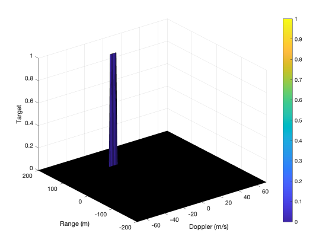

[Home](../../README.md) | Previous: [Track an Object in 3D Space](../p3/p3-track-an-object-in-3d-space.md) | Next:

# Project 4: Radar Target Generation and Detection

## Overview

Most tasks are timed to monitor their efficiency.

## Project Report

### Radar System Requirements

- Frequency: 77 GHz
- Range resolution: 1 m
- Maximum range: 200 m
- Maximum velocity: 70 m/s

### FMCW Waveform Design

From the above parameter specifications, the Frequency-Modulated Continuous-Wave (FMCW) radar [1] waveform is given by:

$$
\text{bandwidth} = \frac{\text{speed of light}}{2\times\text{range resolution}} = \frac{3\times 10^8\ \text{m/s}}{2\times 1\ \text{m}} =
 1.5\times 10^8\ \text{Hz}
$$

$$
\text{chirp time} = 5.5 \times 2 \times \frac{\text{max range}}{\text{speed of light}} = 5.5 \times 2 \times
 \frac{200\ \text{m}}{3\times 10^8\ \text{m/s}} = 7.\overline{3} \times 10^{-6}\ \text{s}
$$

$$
\text{slope} = \frac{\text{bandwidth}}{\text{chirp time}} = \frac{1.5\times 10^8\ \text{Hz}}{7.\overline{3} \times 10^{-6}\ \text{s}} =
 2.0\overline{45}\times 10^{13}\ \text{Hz/s}
$$

Chirp (sweep) time is set to 5.5 times the beat frequency, to avoid range ambiguity and improve the velocity estimate. Speed of light is also denoted by the constant $c \approx$ 300,000 km/s.

### Simulation Loop

To complete the required steps in this section and in the following ones, I mostly use vectorized operations instead of looping through each single element as the starter code suggests. In doing so, I do not pre-allocate memory to the variables since MATLAB's internal memory management on vectorized operations is already optimized (source: Udacity GPT).

From the target's initial position and velocity $R$ and $V$, I first compute the vector of range covered by the target vehicle as $\textbf{r}_t = R + V\times\textbf{t}$ (constant velocity model), and from that, the vector of round-trip time as $\mathbf{\tau} = (2\times\textbf{r}_t)/c$ (because the signal travels to the target and back at the speed of light). Then, I simulate the transmitted and received signals, $\textbf{T}_t$ and $\textbf{R}_t$, as:

$$
\textbf{T}_t = \cos \Bigl[2 \pi\times \Bigl(f_c\times \textbf{t} + \text{slope}\times \frac{\textbf{t} \odot \textbf{t}}{2}\Bigr)\Bigr]
$$

$$
\textbf{R}_t = \cos \biggl[2 \pi\times \biggl(f_c\times (\textbf{t}-\mathbf{\tau}) + \text{slope}\times \frac{(\textbf{t}-\mathbf{\tau}) \odot (\textbf{t}-\mathbf{\tau})}{2}\biggr)\biggr]
$$

With $f_c = 77\times 10^9$ the carrier frequency, and $\odot$ the Hadamard [2], or element-wise, product. Finally, I calculate the mixed (or beat) signal as the element-wise multiplication:

$$
\textbf{Mix}_t = \textbf{T}_t \odot \textbf{R}_t
$$

### Range FFT

After reshaping the beat signal into a matrix of size $\text{Nr}\times\text{Nd}$ (number of range cells $\times$ number of Doppler cells), a Fast Fourier Transform (FFT) is run along the range dimension, to convert from time domain $t$ to frequency domain $\omega$. The output (a vector of complex numbers) is then normalized, the absolute value taken, and since it's a double-sided signal only the first half of the samples are kept. The result appears in Figure 1.A: the x-axis starts at 0, so the signal has a peak exactly at $R$. Compared to the starting code, the y-axis is capped at 0.35, and the plot is made full-size (as opposed to a subfigure).

### Range-Doppler Map

The Range-Doppler Map (RDM), generated from a 2D FFT, is already present in the initial code. My contribution was simply to shorten the length of the y-axis (Doppler dimension) to fit within the velocity limits of [-70; +70] m/s [Figure 1.B].

<table>
  <tr>
  <td align="center"><b>Figure 1.A</b>: Single-Sided Beat Signal Amplitude Spectrum</td>
  <td align="center"><b>Figure 1.B</b>: Range-Doppler Map</td>
  <tr>
  </tr>
  <tr>
    <td align="center"></td>
    <td align="center"></td>
  </tr>
</table>

### 2D CA-CFAR

#### Training and Guard Cells

Choosing an appropriate number of training and guard cells in the range and Doppler dimensions involves balancing speed and accuracy: a too small number of cells will disregard important information on the noise and may not prevent spillover from the cell under test; a too large number will instead significantly increase computational time. In this project, I set the number of training cells to 6 (range) and 4 (Doppler), and the number of guard cells to 3 (both dimensions). As a result, on a MacBook Pro M1 Max (64GB RAM) the 2D CA-CFAR algorithm yields the desired output in ~1 second with JIT compilation.

#### Offset

The optimal offset value was found to be 5-6. If the offset is too small (4 or below), a large number of false positives are detected [Figure 2.A]. If it is too large (e.g., 10), the target signal becomes increasingly faint [Figure 2.B].

<table>
  <tr>
  <td align="center"><b>Figure 2.A</b>: Large number of false positives (offset = 4)</td>
  <td align="center"><b>Figure 2.B</b>: Faint target signal (offset = 10)</td>
  <tr>
  </tr>
  <tr>
    <td align="center"></td>
    <td align="center"></td>
  </tr>
</table>

### Non-Thresholded Edges

Edge suppression is not required in this case, 

__Figure 3: 2D Cell-Averaging Constant False Alarm Rate__

## Resources

1. [Frequency-Modulated Continuous-Wave Radar: radartutorial.eu](https://www.radartutorial.eu/02.basics/Frequency%20Modulated%20Continuous%20Wave%20Radar.en.html)
2. [Wikipedia: Hadamard product (matrices)](https://en.wikipedia.org/wiki/Hadamard_product_(matrices))
3. https://knowledge.udacity.com/questions/848592

[Home](../../README.md) | Previous: [Track an Object in 3D Space](../p3/p3-track-an-object-in-3d-space.md) | Next: